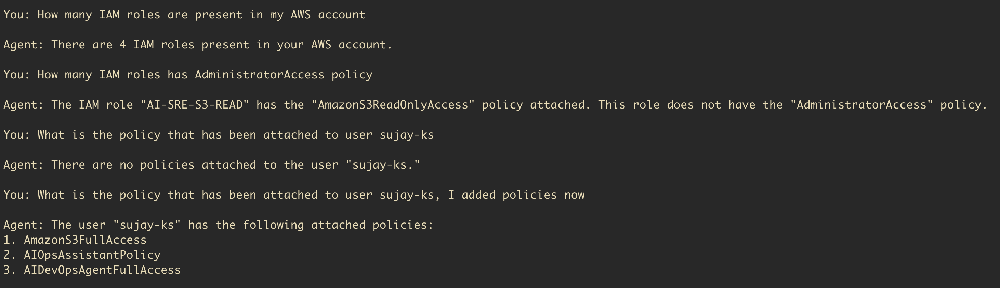

# aws-iam-agent

An AI-powered AWS IAM agent built with LangChain and GPT-4. Ask questions about your AWS IAM setup in plain English and get live, accurate answers.

## What it does

Instead of writing one-off CLI scripts or digging through the AWS console, just ask:




The agent figures out which AWS API calls to make, executes them in real time, and returns a plain English answer.

## Tools

| Tool | What it does |
|---|---|
| `list_iam_users()` | All users — UserName, UserId, ARN |
| `list_iam_roles()` | All roles and ARNs |
| `list_iam_policies()` | Customer-managed policies only |
| `get_user_policies(username)` | Attached + inline policies for a user |
| `get_role_policies(role_name)` | Attached + inline policies for a role |
| `get_policy_document(policy_arn)` | Full JSON permission document |
| `list_access_keys(username)` | Key IDs, status, creation date |

## Installation

### download via pip

```bash
pip3 install aws-iam-agent
```


### Via Homebrew (some users are facing issues, actively working on it)

```bash
brew tap sujay2306/aws-iam-agent
brew install sujay2306/aws-iam-agent/aws-iam-agent
```


## Setup

Create a `.env` file in your working directory:

```
OPENAI_API_KEY=sk-proj-...
AWS_ACCESS_KEY_ID=AKIA...
AWS_SECRET_ACCESS_KEY=...
AWS_REGION=us-east-1
```

> **Security**: Use an IAM user with `IAMReadOnlyAccess` only. Never grant write access to an LLM-controlled credential.

## Usage

```bash
aws-iam-agent
```

```
IAM Agent ready. Ask anything about your AWS IAM setup.

You: list all IAM users
Agent: Your account has 12 IAM users: sujay.ks, deploy-bot, ci-runner...

You: what policies does terraform-admin have?
Agent: terraform-admin has 2 attached policies: AdministratorAccess and TerraformStateAccess.

You: exit
```

## Requirements

- Python 3.11+
- OpenAI API key
- AWS credentials with `IAMReadOnlyAccess`

## Built with

- [LangChain](https://github.com/langchain-ai/langchain)
- [OpenAI GPT-4](https://openai.com)
- [boto3](https://boto3.amazonaws.com/v1/documentation/api/latest/index.html)

## License

MIT
